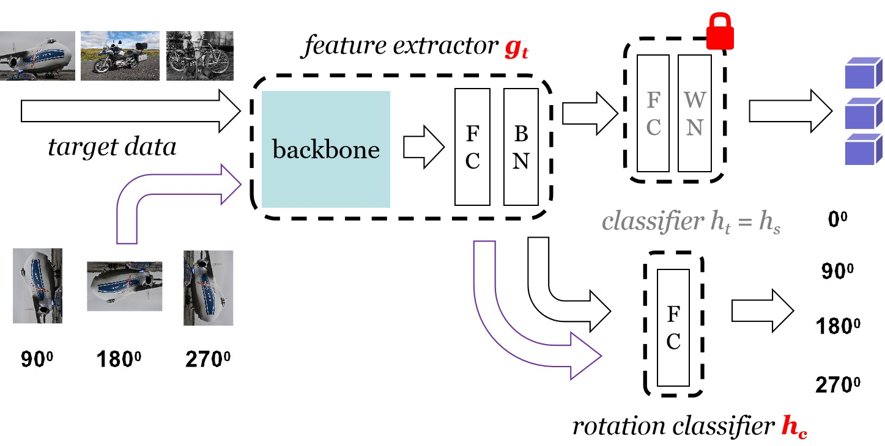
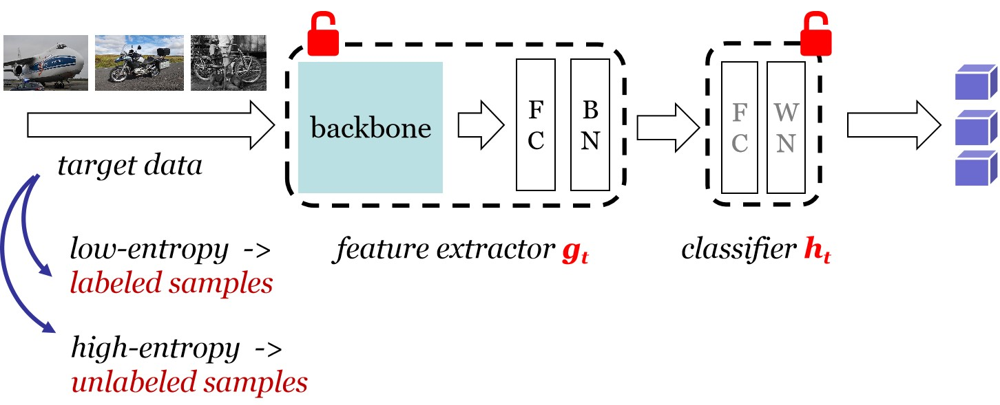

# Official implementation for **SHOT++**

## [**[TPAMI-2021] Source Data-absent Unsupervised Domain Adaptation through Hypothesis Transfer and Labeling Transfer**](https://ieeexplore.ieee.org/abstract/document/9512429/)

### Framework:  

1. train on the source domain; (Section 3.1)
2. **hypothesis transfer with information maximization and *self-supervised learning*; (Section 3.2 & Section 3.3)** 
   (note that SHOT here means results after step 2, which contains an additional rotation-driven self-supervised objective compared with the original SHOT in ICML 2020)



3. **labeling transfer with semi-supervised learning. (Section 3.4)** 
   (note that SHOT++ has an extra semi-supervised learning step via MixMatch)



### Prerequisites:
- python == 3.6.8
- pytorch ==1.1.0
- torchvision == 0.3.0
- numpy, scipy, sklearn, PIL, argparse, tqdm

### Dataset:

- Please manually download the datasets [Office](https://drive.google.com/file/d/0B4IapRTv9pJ1WGZVd1VDMmhwdlE/view), [Office-Home](https://drive.google.com/file/d/0B81rNlvomiwed0V1YUxQdC1uOTg/view), [VisDA-C](https://github.com/VisionLearningGroup/taskcv-2017-public/tree/master/classification), [Office-Caltech](http://www.vision.caltech.edu/Image_Datasets/Caltech256/256_ObjectCategories.tar) from the official websites, and modify the path of images in each '.txt' under the folder './object/data/'. [**How to generate such txt files could be found in https://github.com/tim-learn/Generate_list **]

- Concerning the **Digits** dsatasets, the code will automatically download three digit datasets (i.e., MNIST, USPS, and SVHN) in './digit/data/'.

### Training:
1. ##### Unsupervised Closed-set Domain Adaptation (UDA) on the Digits dataset
	- MNIST -> USPS (**m2u**) 
	```python
	 cd digit/
	 python uda_digit.py --gpu_id 0 --seed 2021 --dset m2u --output ckps_digits --cls_par 0.1 --ssl 0.2 
	 python digit_mixmatch.py --gpu_id 0 --seed 2021 --dset m2u --output ckps_mm --output_tar ckps_digits --cls_par 0.1 --ssl 0.2 --alpha 0.1
	```
2. ##### Unsupervised Closed-set Domain Adaptation (UDA) on the Office/ Office-Home dataset
	- Train model on the source domain **A** (**s = 0**) [--max_epoch 50 for Office-Home]
    ```python
    cd uda/
    python image_source.py --gpu_id 0 --seed 2021 --trte val --da uda --output ckps/source/ --dset office --max_epoch 100 --s 0
    ```
	- Adaptation to other target domains **D and W** (hypothesis transfer)
	```python
   python image_target.py --gpu_id 0 --seed 2021 --da uda --output ckps/target/ --dset office --s 0 --cls_par 0.3 --ssl 0.6
   ```
	- Adaptation to other target domains **D and W** (following labeling transfer) [--max_epoch 50 for Office-Home]
	```python
   python image_mixmatch.py --gpu_id 0 --seed 2021 --da uda --dset office --max_epoch 100 --s 0 --output_tar ckps/target/ --output ckps/mixmatch/ --cls_par 0.3 --ssl 0.6 --choice ent --ps 0.0
   ```

3. ##### Unsupervised Closed-set Domain Adaptation (UDA) on the VISDA-C dataset
	- Train model on the Synthetic domain [--max_epoch 10 --lr 1e-3]
    ```python
    cd uda/
    python image_source.py --gpu_id 0 --seed 2021 --trte val --da uda --output ckps/source/ --dset VISDA-C --net resnet101 --lr 1e-3 --max_epoch 10 --s 0
    ```
	- Adaptation to the real domain (hypothesis transfer)
	```python
   python image_target.py --gpu_id 0 --seed 2021 --da uda --output ckps/target/ --dset VISDA-C --s 0 --net resnet101 --cls_par 0.3 --ssl 0.6
   ```
	- Adaptation to the real domain (following labeling transfer)
	```python
   python image_mixmatch.py --gpu_id 0 --seed 2021 --da uda --dset VISDA-C --max_epoch 10 --s 0 --output_tar ckps/target/ --output ckps/mixmatch/ --net resnet101 --cls_par 0.3 --ssl 0.6 --choice ent --ps 0.0
   ```

4. ##### Unsupervised Partial-set Domain Adaptation (PDA) on the Office-Home dataset
	- Train model on the source domain **A** (**s = 0**)
	```python
	cd pda/
	python image_source.py --gpu_id 0 --seed 2021 --trte val --da pda --output ckps/source/ --dset office-home --max_epoch 50 --s 0
	```

	- Adaptation to other target domains (hypothesis transfer)
	```python
	python image_target.py --gpu_id 0 --seed 2021 --da pda --dset office-home --s 0 --output_src ckps/source/ --output ckps/target/ --cls_par 0.3 --ssl 0.6
	```
	
	- Adaptation to the real domain (following labeling transfer)
	```python 
	python image_mixmatch.py --gpu_id 0 --seed 2021 --da pda --dset office-home --max_epoch 50 --s 0 --output_tar ckps/target/ --output ckps/mixmatch/ --cls_par 0.3 --ssl 0.6 --choice ent --ps 0.0
	```

5. ##### Unsupervised Multi-source Domain Adaptation (MSDA) on the Office-Home dataset
	- Train model on the source domains **Ar** (**s = 0**), **Cl** (**s = 1**), **Pr** (**s = 2**), respectively
	```python
	cd msda/
	python image_source.py --gpu_id 0 --seed 2021 --trte val --da uda --dset office-home --output ckps/source/ --net resnet50 --max_epoch 50 --s 0
	python image_source.py --gpu_id 0 --seed 2021 --trte val --da uda --dset office-home --output ckps/source/ --net resnet50 --max_epoch 50 --s 1
	python image_source.py --gpu_id 0 --seed 2021 --trte val --da uda --dset office-home --output ckps/source/ --net resnet50 --max_epoch 50 --s 2
	```
	
	- Adaptation to the target domain (hypothesis transfer)
	```python
	python image_target.py --gpu_id 0 --seed 2021 --cls_par 0.3 --ssl 0.6 --da uda --dset office-home --output_src ckps/source/ --output ckps/target/ --net resnet50 --s 0
	python image_target.py --gpu_id 0 --seed 2021 --cls_par 0.3 --ssl 0.6 --da uda --dset office-home --output_src ckps/source/ --output ckps/target/ --net resnet50 --s 1
	python image_target.py --gpu_id 0 --seed 2021 --cls_par 0.3 --ssl 0.6 --da uda --dset office-home --output_src ckps/source/ --output ckps/target/ --net resnet50 --s 2
	```

	- Adaptation to the target domain (labeling transfer)
	```python
	python image_mixmatch.py --gpu_id 0 --seed 2021 --da uda --dset office-home --max_epoch 50 --output_tar ckps/target/ --output ckps/mixmatch/ --cls_par 0.3 --ssl 0.6 --choice ent --ps 0.0 --net resnet50 --s 0
	python image_mixmatch.py --gpu_id 0 --seed 2021 --da uda --dset office-home --max_epoch 50 --output_tar ckps/target/ --output ckps/mixmatch/ --cls_par 0.3 --ssl 0.6 --choice ent --ps 0.0 --net resnet50 --s 1
	python image_mixmatch.py --gpu_id 0 --seed 2021 --da uda --dset office-home --max_epoch 50 --output_tar ckps/target/ --output ckps/mixmatch/ --cls_par 0.3 --ssl 0.6 --choice ent --ps 0.0 --net resnet50 --s 2 
	```

	- Combine domain-spetific scores together
	```python
	python image_ms.py --gpu_id 0 --seed 2021 --cls_par 0.3 --ssl 0.6 --da uda --dset office-home --output_src ckps/source/ --output ckps/target/ --output_mm ckps/mixmatch/ --net resnet50 --t 3
	```

6. ##### Semi-supervised Domain Adaptation (SSDA) on the Office-Home dataset
	- Train model on the source domain **Ar** (**s = 0**)
	```python
	cd ssda/
	python image_source.py --gpu_id 0 --seed 2021 --output ckps/source/ --dset office-home --max_epoch 50 --s 0
	```
	
	- Adaptation to the target domain **Cl** (**t = 1**) [hypothesis transfer]
	```python	
	python image_target.py --gpu_id 0 --seed 2021 --cls_par 0.1 --ssl 0.2 --output_src ckps/source --output ckps/target --dset office-home --s 0 --t 1 
	```

	- Adaptation to the target domain **Cl** (**t = 1**) [labeling transfer]
	```python
	python image_mixmatch.py --gpu_id 0 --seed 2021 --ps 0.0 --cls_par 0.1 --ssl 0.2 --output_tar ckps/target --output ckps/mixmatch --dset office-home --max_epoch 50 --s 0 --t 1
	```

**Please refer *./xxda/run_xxda.sh*** for all the settings for different methods and scenarios.

### Citation

If you find this code useful for your research, please cite our papers
```
@article{liang2021source,  
 title={Source Data-absent Unsupervised Domain Adaptation through Hypothesis Transfer and Labeling Transfer}, 
 author={Liang, Jian and Hu, Dapeng and Wang, Yunbo and He, Ran and Feng, Jiashi},   
 journal={IEEE Transactions on Pattern Analysis and Machine Intelligence (TPAMI)},
 year={2021}, 
 note={In Press}  
}

@inproceedings{liang2020we, 
 title={Do We Really Need to Access the Source Data? Source Hypothesis Transfer for Unsupervised Domain Adaptation}, 
 author={Liang, Jian and Hu, Dapeng and Feng, Jiashi}, 
 booktitle={International Conference on Machine Learning (ICML)},  
 pages={6028--6039},
 year={2020}
}
```

### Contact

- [liangjian92@gmail.com](mailto:liangjian92@gmail.com)
- [dapeng.hu@u.nus.edu](mailto:dapeng.hu@u.nus.edu)
- [elefjia@nus.edu.sg](mailto:elefjia@nus.edu.sg)
